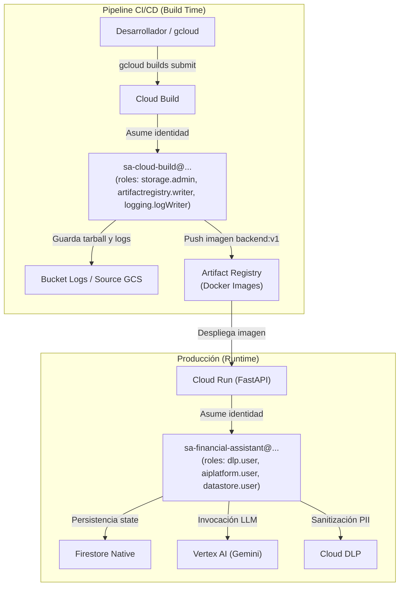

# Decisiones de Arquitectura GCP: Cloud Build, IAM y Almacenamiento

Este documento complementa a [`docs/gcp_deployment_and_iam.md`](file:///home/santi/Documentos/Curso%20Ciberseguridad/gcp-projects/financial_asistent/docs/gcp_deployment_and_iam.md). Detalla las decisiones técnicas, de ciberseguridad y de configuración adoptadas durante la creación de la base de datos Firestore, el repositorio en Artifact Registry, la resolución de errores en Cloud Build y el desacoplamiento de Service Accounts entre tiempo de compilación (*Build time*) y tiempo de ejecución (*Runtime*).

---

## 1. Decisiones sobre Cloud Firestore

Al inicializar Firestore en Google Cloud se presentaron dos decisiones críticas:

### A. Modo de la Base de Datos: Modo Nativo vs. Modo Datastore

| Modo | Características | Decisión y Criterio |
| :--- | :--- | :--- |
| **Modo Nativo** *(Elegido)* | Soporta colecciones jerárquicas (subcolecciones), listeners en tiempo real, consultas compuestas y SDKs cliente y servidor modernos. | **Seleccionado**: Es el estándar moderno para arquitecturas de microservicios y backend (FastAPI / Cloud Run). Permite estructurar los checkpoints de LangGraph de forma óptima. |
| **Modo Datastore** | Modo de compatibilidad hacia atrás con Google App Engine Datastore heredado (*legacy*). | **Descartado**: Carece de listeners en tiempo real y subcolecciones nativas; solo se justifica al migrar sistemas preexistentes. |

### B. Reglas de Seguridad Iniciales: Modo Restrictivo vs. Modo Abierto

* **Modo Abierto (Prueba):** Permite acceso libre de lectura y escritura a cualquier cliente web o móvil durante 30 días sin autenticación. **Riesgo crítico de fuga y alteración de datos.**
* **Modo Restrictivo (Producción / Elegido):** Bloquea todas las operaciones directas desde SDKs cliente por defecto.
* **Criterio de Ciberseguridad:** 
  El backend en Cloud Run se comunica con Firestore utilizando el SDK oficial de Python (`google-cloud-firestore`) autenticado mediante credenciales de IAM (`roles/datastore.user`). **Las reglas de seguridad de Firestore aplican únicamente a peticiones directas de SDKs móviles/web, no al SDK del servidor.** Al configurar el modo Restrictivo, se cierra cualquier exposición hacia internet sin interferir en la operatividad del backend.

---

## 2. Decisiones sobre Artifact Registry

Al crear el repositorio para alojar las imágenes Docker se evaluaron los cuatro modos disponibles:

1. **Estándar (*Standard* - Elegido):** Repositorio privado convencional donde el usuario tiene control total de subida (`push`) y descarga (`pull`). Almacena las imágenes Docker de frontend y backend para Cloud Run.
2. **Remoto (*Remote*):** Actúa como caché y proxy hacia registros externos (como Docker Hub o PyPI). No permite `push` de imágenes propias.
3. **Conector (*Preview Connector*):** Gestiona conexiones autenticadas hacia orígenes externos sin infraestructura virtual completa.
4. **Virtual (*Virtual*):** Enrutador lógico que agrupa múltiples repositorios (estándar y remotos) bajo una misma URL.

### Corrección de Nomenclatura del Repositorio
* El repositorio fue registrado en GCP como `financial-assitant-repository` en la región `us-central1`.
* El tag de Docker debe coincidir exactamente con el recurso en GCP:  
  `us-central1-docker.pkg.dev/<PROJECT_ID>/financial-assitant-repository/backend:<TAG>`

---

## 3. Arquitectura de Service Accounts: Build Time vs. Runtime

En [`docs/gcp_deployment_and_iam.md`](file:///home/santi/Documentos/Curso%20Ciberseguridad/gcp-projects/financial_asistent/docs/gcp_deployment_and_iam.md) se definió la cuenta de **Runtime** (`sa-financial-assistant`). Para las tareas de compilación y despliegue se adoptó una cuenta dedicada de **Build/CI-CD**.



### ¿Por qué NO usar la cuenta por defecto `[PROJECT_NUMBER]-compute@developer.gserviceaccount.com`?
1. **Nomenclatura engañosa:** Aunque el dominio incluye `@developer.gserviceaccount.com`, no representa a un usuario humano, sino a la cuenta del sistema de Compute Engine.
2. **Políticas modernas "Secure by Default":** En proyectos de GCP recientes, Google despojó a esta cuenta del rol automático de `Editor`. Por defecto, carece de permisos para leer buckets o escribir en Artifact Registry.
3. **Principio de Menor Privilegio (Least Privilege):** Mezclar las funciones del compilador con las del motor de cómputo general genera sobreexposición de privilegios.

### Service Account dedicada: `sa-cloud-build`
Se creó la identidad dedicada:  
`sa-cloud-build@ai-security-508122.iam.gserviceaccount.com`

#### Matriz de Roles Asignados

| Rol de IAM | Identificador | Propósito Técnico |
| :--- | :--- | :--- |
| **Storage Admin** | `roles/storage.admin` | Permite a Cloud Build leer el tarball del código fuente y gestionar el bucket regional de logs (`gs://711411099142-us-central1-cloudbuild-logs`). |
| **Artifact Registry Writer** | `roles/artifactregistry.writer` | Otorga autorización para realizar el `docker push` de las capas de la imagen compilada hacia el repositorio. |
| **Logs Writer** | `roles/logging.logWriter` | Permite canalizar y emitir los flujos de texto del build hacia Google Cloud Logging. |

> [!IMPORTANT]
> **Ciclo de vida y persistencia:**  
> Las Service Accounts son componentes permanentes de infraestructura (no máquinas virtuales ni contenedores) y **no conllevan costo por existencia**. **Nunca deben eliminarse tras ejecutar un build**, ya que deben quedar disponibles para futuros despliegues o automatizaciones con GitHub Actions / GitLab CI.

---

## 4. Gestión de Logs en Cloud Build con Service Accounts Personalizadas

### Causa del error `INVALID_ARGUMENT`
Por diseño histórico, Cloud Build intenta escribir logs en el bucket global `gs://[PROJECT_ID]_cloudbuild`. Sin embargo, al invocar `--service-account` con una cuenta personalizada, las políticas de seguridad exigen declarar explícitamente el destino de los registros para evitar escrituras no controladas en almacenamiento no delimitado.

### Solución aplicada
Se especificó la bandera `--default-buckets-behavior=regional-user-owned-bucket` y se definió la región (`--region=us-central1`). Con esto, Cloud Build utiliza un bucket regional administrado:  
`gs://[PROJECT_NUMBER]-us-central1-cloudbuild-logs`

---

## 5. Higiene del Contexto de Compilación (`.gcloudignore`)

Durante la primera ejecución, Cloud Build intentó subir **18.333 archivos (630.3 MiB)**.

### Causa Técnica
1. **Mecánica de Cloud Build:** El comando `gcloud builds submit` no construye el contenedor localmente. Comprime todo el contenido del directorio en un archivo `.tar.gz` y lo sube a Cloud Storage antes de iniciar la compilación en los servidores de Google.
2. **Ubicación de `.gcloudignore`:** `gcloud` busca el archivo de exclusión **en la raíz del directorio que se está subiendo**. Si el comando especifica `gcloud builds submit backend`, el archivo de exclusiones debe ubicarse en `backend/.gcloudignore`.

### Consecuencias de Omitir `.gcloudignore`
* **Incompatibilidad binaria:** Sube el entorno virtual local (`.venv`) con librerías compiladas para la arquitectura de la máquina anfitriona, lo que puede romper el contenedor Linux Alpine/Debian.
* **Fuga de secretos:** Riesgo de empaquetar archivos `.env` locales con API keys de prueba.
* **Sobrecarga de red:** Tiempos de transferencia excesivos.

Al incorporar [`backend/.gcloudignore`](file:///home/santi/Documentos/Curso%20Ciberseguridad/gcp-projects/financial_asistent/backend/.gcloudignore), el paquete se redujo a **32 archivos y 71.8 KiB** (reducción del 99.98%).

---

## 6. Comando Consolidado de Compilación

El comando validado para enviar la imagen a Cloud Build bajo la configuración de seguridad establecida es:

```bash
gcloud builds submit backend \
    --service-account="projects/ai-security-508122/serviceAccounts/sa-cloud-build@ai-security-508122.iam.gserviceaccount.com" \
    --default-buckets-behavior=regional-user-owned-bucket \
    --region=us-central1 \
    --tag us-central1-docker.pkg.dev/ai-security-508122/financial-assitant-repository/backend:v1
```
